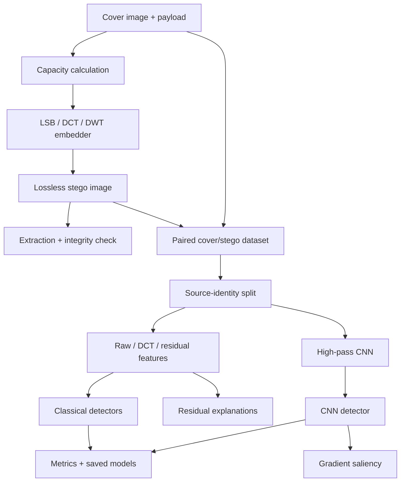

# StegoCkavas — Image Steganography & Steganalysis Lab

[](https://github.com/cagataykavas/stegoCkavas/actions/workflows/ci.yml)

A reproducible Python lab for **image steganography, steganalysis, forensic feature engineering, classical ML, CNN detection, and explanation tooling**. The repository can hide and recover UTF-8 payloads with pixel- and transform-domain methods, build leakage-aware cover/stego datasets, train detectors, and produce residual/saliency evidence.

The project deliberately separates three claims that are often blurred together:

1. **Steganography** conceals the existence of a payload; it is not automatically encryption.
2. **Integrity** checks such as CRC32 detect accidental corruption; they are not authentication.
3. **Detection accuracy** is only meaningful when dataset identity, pairing, preprocessing, split policy, payload, and algorithm are controlled.

## What is runnable now

The repaired package lives under `stego_ai/` and exposes a CLI:

```bash
python -m venv .venv
source .venv/bin/activate          # Windows: .venv\Scripts\activate
python -m pip install -e ".[dev]"

python -m stego_ai demo --output-dir demo_output
```

The zero-dataset demo creates a deterministic textured cover, performs real PNG round trips for LSB, DCT, and DWT, verifies recovered UTF-8 text, calculates PSNR, hashes outputs, and writes `demo_report.json`.

No detector score in this README is fabricated. Measured detector metrics belong to a named dataset/run artifact.

## Research questions

The project supports experiments such as:

- How detectable are LSB, PVD, DCT, and DWT embedding methods?
- How does payload in bits per pixel affect detection difficulty?
- Do residual histograms or residual co-occurrences expose embedding artifacts more cleanly than raw RGB?
- How do Logistic Regression, SVM, Random Forest, and optional boosting models compare on identical splits?
- Can a detector generalize across embedding algorithms rather than memorize one generator?
- Where does a CNN focus when it predicts that an image is steganographic?
- How much of an apparently strong score disappears when source-image leakage is removed?

## System architecture



See `docs/ARCHITECTURE.md` for the experiment contracts and `SECURITY.md` for the security/non-cryptographic boundary.

## Payload round trips

### Embed

```bash
python -m stego_ai embed \
  --input cover.png \
  --output hidden.png \
  --algorithm dct \
  --message "meet at 18:30" \
  --seed 42
```

### Extract

```bash
python -m stego_ai extract --input hidden.png --key hidden.png.key.json
python -m stego_ai describe
```

The key manifest records reproducibility metadata. DCT/DWT payloads also use a versioned header, payload length, transform parameters, redundancy, and CRC32. LSB extraction uses the same seed-controlled channel permutation.

## Supported embedding methods

| Method | Domain | UTF-8 round trip | Role |
|---|---|---:|---|
| LSB | RGB channel values | yes | simple spatial-domain baseline |
| DCT | 8×8 luminance blocks | yes | transform-domain QIM/parity embedding |
| DWT | Haar detail coefficients | yes | transform-domain QIM/parity embedding |
| PVD | neighbouring pixel differences | dataset generation | perturbation baseline |
| DFT / SVD | frequency / matrix domains | dataset generation | experimental perturbation baselines |

Transform-domain text payloads are checked against real capacity after header and repetition overhead. User text is rejected when oversized rather than silently truncated.

## Dataset and steganalysis pipeline

Install the analysis extras:

```bash
python -m pip install -e ".[analysis]"
```

Example:

```bash
python -m stego_ai.pipeline \
  --cover-dir data/covers \
  --work-dir runs/bpp_0p2 \
  --bpp 0.2 \
  --algorithms lsb pvd dct dwt \
  --feature-method residual_cooc \
  --models rf logreg svm \
  --normalize-covers \
  --save-models
```

The dataset preparation path preserves source-image identity so a cover and its near-identical stego variant are assigned consistently. Splitting variants independently would contaminate test results.

### Feature contracts

| Feature | Typical role |
|---|---|
| raw RGB | content-heavy sanity baseline |
| block DCT summaries | transform-energy representation |
| residual histogram | compact high-pass distribution |
| residual co-occurrence | directional SPAM-like local dependency representation |

### Detector families

Dependency-safe defaults are:

- Logistic Regression
- SVM
- Random Forest

Optional XGBoost and LightGBM are installed separately rather than being required for the first runnable path.

## CNN detector and explanations

Install deep-learning extras:

```bash
python -m pip install -e ".[analysis,deep]"
```

Train:

```bash
python -m stego_ai.train_stego_cnn \
  --dataset-dir runs/bpp_0p2/classification_binary \
  --task binary \
  --epochs 25
```

Generate saliency artifacts using the same checkpoint/model contract:

```bash
python scripts/heatmaps_cnn.py \
  --dataset-dir runs/bpp_0p2/classification_binary \
  --checkpoint runs/bpp_0p2/classification_binary/stegocnn_binary/stegocnn_best.pt \
  --out-dir runs/bpp_0p2/saliency
```

`StegoNetLite` starts from fixed high-pass filters and truncation before a compact learned convolutional tower. Residual maps and input-gradient saliency are deliberately documented as different explanation types.

## Repository map

```text
stego_ai/
  __main__.py                 module entry point
  cli.py                      embed/extract/demo/describe commands
  stego_algorithms.py         spatial + transform embedding primitives
  dataset_preparation.py      paired dataset generation and splitting
  models.py                   features + classical ML contracts
  pipeline.py                 end-to-end experiment runner
  train_stego_cnn.py          CNN training
  backend_api.py              programmatic integration surface
  gui.py                      desktop interface
scripts/
  heatmaps_cnn.py             CNN saliency
  run_bpp_sweep.py            payload sweeps
  qualitative_report.py       ranked examples/failures
  make_report_figures.py      report artifacts
  visualize_residual_map.py   residual diagnostics
tests/test_stego_lab.py       round-trip/capacity/feature/contract coverage
docs/ARCHITECTURE.md          architecture and evaluation design
SECURITY.md                   threat model and non-claims
pyproject.toml                package + optional dependency groups
.github/workflows/ci.yml      compile/demo/test pipeline
```

## Evaluation checklist

A credible steganalysis run should record:

1. source dataset and preprocessing;
2. source-image identity before splitting;
3. embedding algorithm and payload/BPP;
4. deterministic seeds;
5. train/validation/test manifests;
6. balanced accuracy, macro F1, per-class precision/recall and confusion matrices;
7. cross-payload and cross-algorithm generalization;
8. failure cases and explanation artifacts.

A very high classifier score can be a symptom of content leakage, filename leakage, or broken pairing. It is not automatically evidence of a strong detector.

## CI evidence

GitHub Actions currently checks the runnable path rather than pretending to train a research detector on every push:

- install the package and analysis/dev extras;
- compile package, scripts, tests, and compatibility launcher;
- execute the zero-dataset LSB/DCT/DWT integration demo;
- run the test suite.

## Security boundary

This is an educational/research steganography project, **not an encryption library**. Seeds are not secret keys, CRC32 is not a MAC, and the implementation is not reviewed for confidentiality against a capable adversary. See `SECURITY.md` for the explicit boundary.

## Provenance

This is a personal project reconstructed from an earlier flat student/research codebase. The repair preserves the original problem domain while replacing dead imports, inconsistent file layout, syntax-broken CNN utilities, and non-runnable experiment assumptions with a package, tests, CLI, and reproducible integration path.
