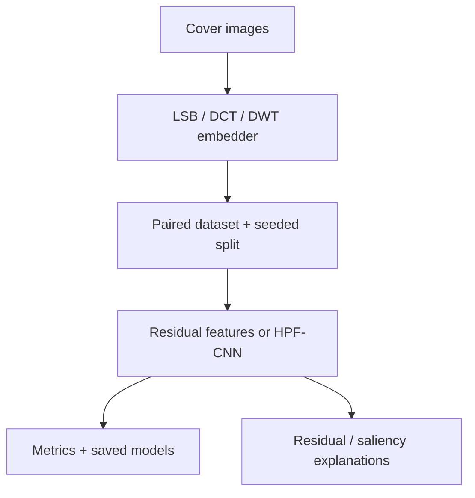

# Stego Lab

[](https://github.com/cagataykavas/stegoCkavas/actions/workflows/ci.yml)

A reproducible image-steganography and steganalysis lab. It hides and recovers UTF-8 payloads with pixel- and transform-domain methods, builds paired cover/stego datasets, trains classical or CNN detectors, and produces residual and saliency explanations.

The project makes an important distinction: steganography conceals the existence of a payload; it does not automatically encrypt it. Seeds and CRCs here support reproducibility and integrity checks, not cryptographic confidentiality.

## Zero-dataset demo

```bash
python -m venv .venv
source .venv/bin/activate  # Windows: .venv\Scripts\activate
python -m pip install -e ".[dev]"

python -m stego_ai demo --output-dir demo_output
```

The command creates a deterministic textured cover, runs LSB, DCT, and DWT round trips through PNG files, verifies the recovered text, calculates PSNR, hashes every output, and writes `demo_report.json`.

```json
{
  "status": "ok",
  "algorithms": {
    "lsb": {"round_trip": true},
    "dct": {"round_trip": true},
    "dwt": {"round_trip": true}
  }
}
```

That JSON is illustrative in shape; run the command for measured PSNR values and hashes on your machine.

## Hide and recover a message

```bash
python -m stego_ai embed \
  --input cover.png \
  --output hidden.png \
  --algorithm dct \
  --message "meet at 18:30" \
  --seed 42

python -m stego_ai extract --input hidden.png --key hidden.png.key.json
python -m stego_ai describe
```

`embed` writes a small key manifest beside the image. DCT and DWT also store a versioned header, payload length, seed, transform parameters, and CRC32 inside the image. LSB extraction requires the same seed-controlled permutation.

## Algorithms

| Method | Domain | Text round trip | Main mechanism |
|---|---|---:|---|
| LSB | pixel channels | yes | Seeded channel permutation and delimited UTF-8 bits |
| DCT | 8×8 luminance blocks | yes | QIM coefficient parity, repeated bits, majority vote |
| DWT | Haar detail bands | yes | QIM coefficient parity, repeated bits, majority vote |
| PVD | pixel differences | dataset augmentation | Difference-parity perturbation |
| DFT / SVD | frequency / matrix | dataset augmentation | Small seeded perturbations |

Requested transform-domain payloads are capped to the capacity left after headers and redundancy. `payload_capacity_bytes()` exposes that limit instead of letting high-BPP dataset jobs crash halfway through.

## Steganalysis pipeline

Install the analysis stack and point the pipeline at a directory of cover images:

```bash
python -m pip install -e ".[analysis]"

python -m stego_ai.pipeline \
  --cover-dir data/covers \
  --work-dir runs/bpp_0p2 \
  --bpp 0.2 \
  --algorithms lsb pvd dct dwt \
  --feature-method residual_cooc \
  --models rf logreg svm \
  --normalize-covers \
  --save-models
```

The pipeline builds paired train/validation/test folders, extracts features, evaluates binary cover-vs-stego and optional algorithm-level classifiers, and saves metrics and fitted models. XGBoost and LightGBM are optional extras: `pip install -e ".[analysis,boost]"`.

Handcrafted feature choices are raw pixels, block-DCT summaries, residual histograms, and compact residual co-occurrences. The default models avoid optional native dependencies so the first run actually works.

## CNN detector and explanations

```bash
python -m pip install -e ".[analysis,deep]"

python -m stego_ai.train_stego_cnn \
  --dataset-dir runs/bpp_0p2/classification_binary \
  --task binary \
  --epochs 25

python scripts/heatmaps_cnn.py \
  --dataset-dir runs/bpp_0p2/classification_binary \
  --checkpoint runs/bpp_0p2/classification_binary/stegocnn_binary/stegocnn_best.pt \
  --out-dir runs/bpp_0p2/saliency
```

`StegoNetLite` starts with fixed high-pass filters and truncation before a compact convolutional tower. The explanation script uses the exact training model/checkpoint contract and writes both overlays and a JSON manifest. Other scripts generate residual maps, qualitative error cards, report figures, and BPP sweeps.

## Design



See [architecture](docs/ARCHITECTURE.md) and the [security boundary](SECURITY.md) for interfaces, evaluation pitfalls, and non-goals.

## Repository map

```text
stego_ai/                    package, CLI, embedding, datasets, models, GUI, CNN
scripts/                     sweeps, figures, residual maps, qualitative analysis
tests/                       round-trip, capacity, feature, and contract tests
docs/ARCHITECTURE.md         system and experiment design
SECURITY.md                  threat model and cryptographic non-claims
run.py                       compatibility CLI launcher
```

## Evidence status

- CI compiles every module and runs real PNG round trips for LSB, DCT, and DWT.
- Tests cover capacity accounting, residual feature dimensions, CLI contracts, and safe default models.
- No detector accuracy is claimed in this README without a dataset, split manifest, and measured run artifacts.
- A high classifier score can indicate content leakage or broken pairing; it is not automatically proof of good steganalysis.
