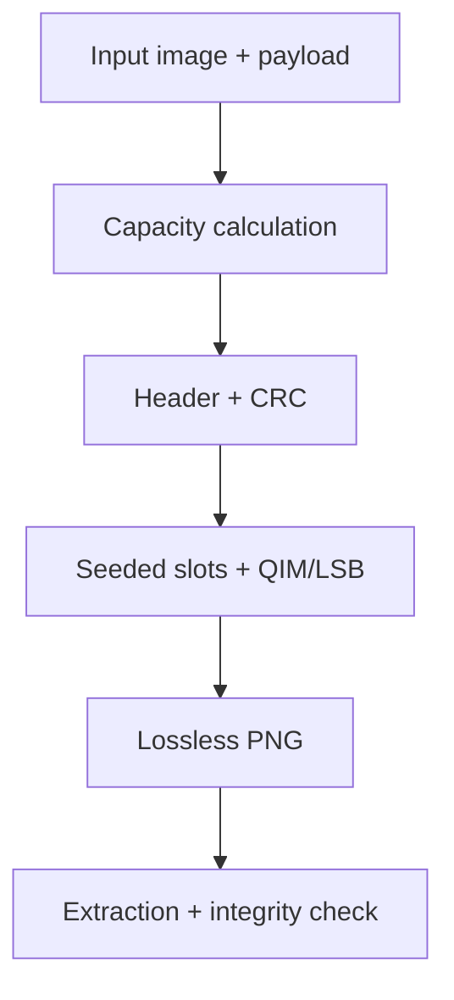

# Architecture and experiment design

## Embedding path

LSB shuffles pixel-channel indices with a seeded PRNG and embeds a delimited UTF-8 bit stream. DCT converts luminance 8×8 blocks and changes selected mid-frequency coefficients with quantization-index modulation. DWT performs a one-level Haar transform and embeds in the LH and HL detail bands.

Transform messages use a fixed-size versioned header and repeated coefficient samples. Majority voting absorbs some coefficient drift caused by inverse transforms and uint8 rounding. CRC32 detects a corrupt recovery but does not authenticate an attacker-controlled message.

`payload_capacity_bytes()` deducts header and repetition overhead. Dataset-mode random payloads are capped to that real capacity. User-supplied text remains strict: an oversized message raises an error instead of being silently truncated.

## Dataset path

`dataset_preparation.py` normalizes covers to PNG, generates one stego image per cover and algorithm, and uses image stems to preserve pairing. It then creates binary and multiclass folder trees with one seeded split assignment shared across cover and stego variants.

Pairing matters. If a cover lands in training while its near-identical stego variant lands in test, a detector score is contaminated. The preparation module therefore splits stems before copying variants.

## Detector path

Classical models operate on one of four feature contracts:

| Feature | Dimension | Purpose |
|---|---:|---|
| raw RGB | configurable | content-heavy baseline |
| mean block DCT | 64 by default | transform-energy summary |
| residual histogram | 18 | compact high-pass distribution |
| residual co-occurrence | 162 | directional SPAM-like dependency summary |

Random forest, logistic regression, and SVM are dependency-safe defaults. XGBoost and LightGBM are optional.

The CNN begins with five fixed high-pass kernels, truncates extreme residuals, and learns a compact convolutional classifier. Adaptive average pooling makes the classifier independent of the crop's final spatial size.

## Explanation path

- residual maps visualize high-frequency energy and are image diagnostics, not model explanations;
- input-gradient saliency explains the CNN prediction locally;
- occlusion heatmaps perturb regions and measure the classical model's probability change;
- qualitative reports rank correct and incorrect examples and write reproducible manifests.

These methods answer different questions and should not be presented as interchangeable.

## Evaluation checklist

1. Record dataset identity, hashes, image preprocessing, payload, algorithm, and seed.
2. Split by source-image identity before creating algorithm variants.
3. Report balanced accuracy, macro F1, per-class precision/recall, and confusion matrices.
4. Sweep payload sizes and include a content-only baseline.
5. Test cross-algorithm and cross-dataset generalization.
6. Keep test data out of model and threshold selection.
7. Publish failure cases and explanation artifacts, not only a best score.

